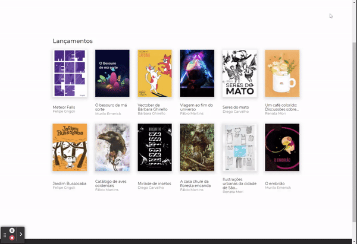

# iBook

<div align="center">
  <h1>
    
  </h1>
  Um simples blog para leitura de livros cujos dados são obtidos através do consumo de uma API, utilizando Nuxt.JS e Atomic Design
  <br><br>

  
  
  
  

</div>

<div align="center">

## 🎲 Apresentação





## 🎲 Rodando o Projeto

</div>

```bash
# install dependencies
$ npm install

# serve with hot reload at localhost:3000
$ npm run dev

# build for production and launch server
$ npm run build
$ npm run start

# generate static project
$ npm run generate
```
